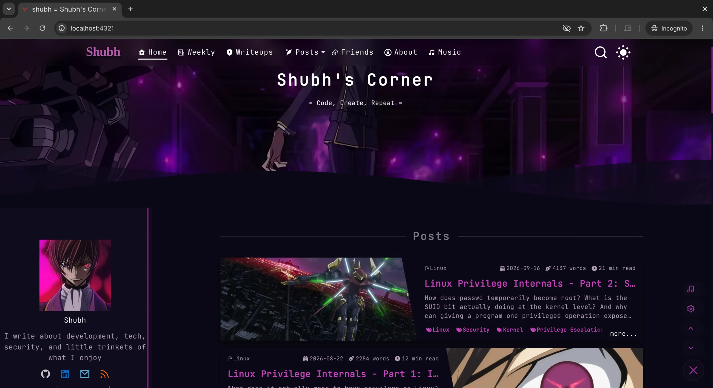
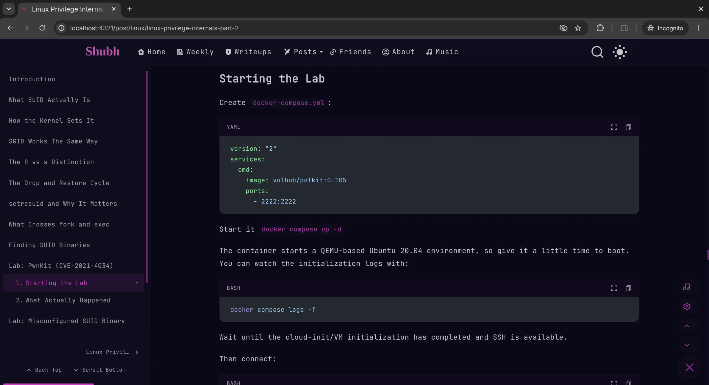
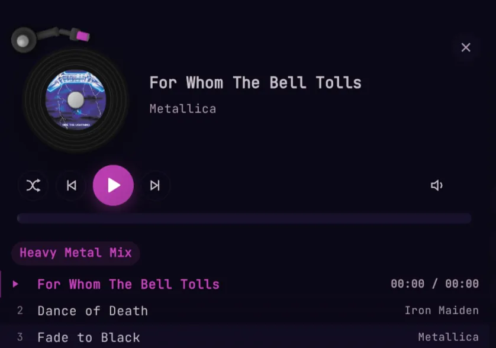
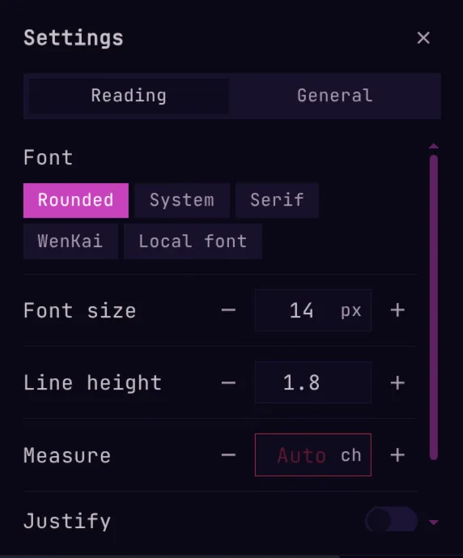

# Shubh's Corner

<div align="center">

[](https://shubhsec.dev)
[](https://github.com/shubh1855)
[](https://www.linkedin.com/in/shubhranil-paul)
[](https://astro.build)
[](https://www.typescriptlang.org/)
[](./LICENSE)

**Code, Create, Repeat**

_A personal blog and portfolio focusing on cybersecurity CTF writeups, Linux internals, container runtimes, tech explorations, and background music playback._

</div>

---

<!-- Banner Preview: Replace with your custom banner or full-width site header -->


---

## Screenshots

<!-- Drop your screenshots into public/img/screenshots/ and update the image paths below -->

| Desktop Home View | Security and CTF Writeup View |
| :---: | :---: |
|  <br> _Homepage with featured categories and Code Geass aesthetics_ |  <br> _In-depth writeups with syntax highlighting, TOC, and callout blocks_ |

| Persistent Background Music Player | Geass Toolbar and Reader Settings |
| :---: | :---: |
|  <br> _Floating audio panel with multi-playlist tabs and vinyl disc animation_ |  <br> _Quick navigation toolbar with reader customizations and theme toggles_ |

---

## Implementation Details

### Background Music Player Architecture

The blog features an ambient music player that remains persistent while browsing between pages, solving browser limitations around iframe destruction during client-side navigation:

- **View Transitions Lifecycle Manager (`src/lib/yt-player-manager.ts`)**: Astro View Transitions detach and recreate elements during page swaps. Modern browsers force-reload or destroy moved iframes, turning standard YouTube player instances into disconnected zombie objects. The lifecycle manager registers `astro:before-swap` to snapshot the exact playback state (video ID, timestamp, volume, mute, playing/paused) and `astro:page-load` to rebuild the container, re-instantiate `window.YT.Player`, and resume playback via `seekTo()`.
- **Rapid Navigation Guard**: A restore lock prevents consecutive link clicks from overwriting valid snapshot timestamps with stale mid-buffering data.
- **Shared Media Controls**: Both global BGM and markdown-embedded media players share a unified control system (`MediaControls.tsx`). Volume sliders dynamically apply `linear-gradient` and `::-moz-range-progress` fills to display active volume levels.
- **Auto-Recovery**: Automatic error handling detects unavailable or blocked YouTube IDs and skips to the next track after a 2-second timeout to prevent infinite loading states.

### Search and Indexing Architecture

- **Serverless Full-Text Search**: Powered by Pagefind. Search indices are generated statically at build time, enabling sub-millisecond full-text queries across writeups, tags, and categories without requiring an external backend or database.
- **Low-Quality Image Placeholders (LQIP)**: Content images feature pre-computed gradient color placeholders generated at build time to prevent layout shifts and enhance perceptual load speeds.
- **Build Caching**: The repository tracks `.cache/og-data.json` to persist Open Graph metadata for embedded external links, preventing repetitive external network calls during static generation.

### Markdown Enhancement Engine

- **Code Block Controls**: Collapsible code sections, line highlights, command execution buttons, and one-click copy functionality.
- **Extended Markdown Syntax**: Full support for Shoka-compatible effects including spoilers, ruby annotations, admonition callouts, KaTeX mathematical typesetting, and Mermaid diagram generation.
- **Content Encryption**: Client-side AES-256-GCM decryption for sensitive or confidential notes, where passwords are only validated during build generation and never sent over the network.

---

## Content and Topics

- **Cybersecurity CTF Writeups**: Solutions and walk-throughs covering Cryptography, Reverse Engineering, Pwn, Forensics, and Web Exploitation from competitions including:
  - HTB Cyber Apocalypse (The Salt Crown)
  - RAIT-CTF Finals
  - Xploitathon CTF
  - Technovate CTF
- **Linux and Systems Engineering**: Kernel privilege internals, capability boundaries, system calls, and building container runtimes from scratch with runc, namespaces, and cgroups.
- **Weekly Digests**: Curated engineering summaries, tools, and technical insights.

---

## Koharu CLI and Local CMS

The repository includes a dedicated CLI and a lightweight CMS for content authoring and maintenance:

```bash
pnpm koharu new post          # Scaffold a new blog post with metadata
pnpm koharu backup            # Backup posts, configuration, and assets
pnpm koharu restore --latest  # Restore content from the most recent backup
pnpm koharu generate all      # Regenerate LQIP placeholders, similarities, and AI summaries
pnpm koharu migrate           # Migrate post frontmatter and permalinks
```

To run the local browser-based CMS:

```bash
pnpm cms:install
pnpm cms
```

The CMS provides in-browser editing, markdown previews, and direct opening in local editors (VS Code, Cursor, Zed).

---

## Local Development

Ensure Node.js (>= 22.20.0) and pnpm (>= 10.28.2) are installed.

1. Clone the repository:

   ```bash
   git clone https://github.com/shubh1855/my-blog.git
   cd my-blog
   ```

2. Install dependencies:

   ```bash
   pnpm install
   ```

3. Start the development server:

   ```bash
   pnpm dev
   ```

4. Build for production:

   ```bash
   pnpm build
   ```

5. Preview the production build:
   ```bash
   pnpm preview
   ```

---

## Credits and License

- Architecture foundation derived from [astro-koharu](https://github.com/cosZone/astro-koharu) and Hexo Shoka.
- Persistent YouTube View Transitions implementation and security content by [Shubh](https://github.com/shubh1855).
- Licensed under the [GNU Affero General Public License v3.0 (AGPL-3.0)](./LICENSE).
