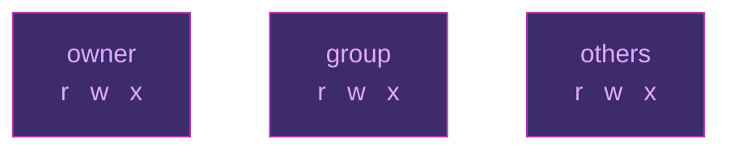
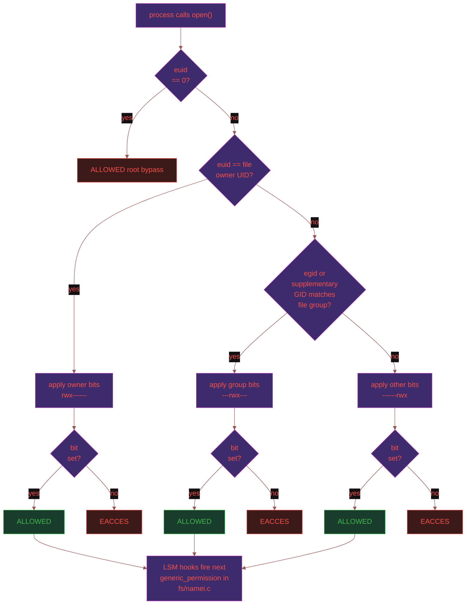
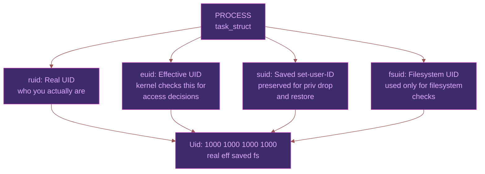
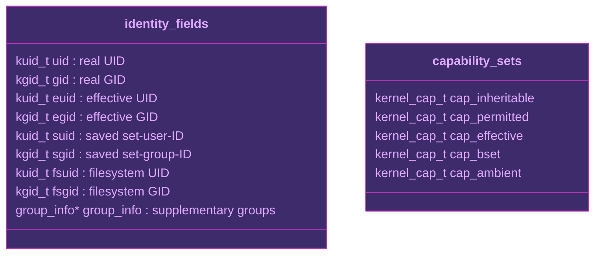
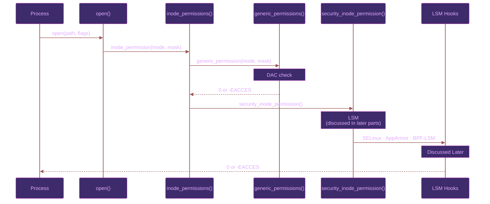

> This is the first article in a series on Linux privilege internals. The series traces a single question: what does it actually mean to have privilege on Linux, and how did we get here.

# Introduction

Every process in Linux has an identity. This identity determines what it can read, write and also what it can execute. The usual model is files have permissions, users have ownership, and if they match, access is granted.

But the more I dug into how Linux actually enforces this, the more I realised the model was more layered than it first appears. The [article by Nathaniel Fernandes](https://docs.wehost.co.in/blog/roles-are-just-an-abstraction-rethinking-authorization-from-first-principles) talked about how permissions are the primitive in IAM systems, not roles. Linux has the same problem, just one layer lower. Thanks to [Adhokshaj Mishra](https://www.linkedin.com/in/adhokshajmishra/) for further encouragement to dig into this.

# The Traditional Model

Linux inherited its permission model from the Unix. Unix was designed in the early 1970s for shared systems where multiple users needed isolated access to files.

The solution for this problem was simple. Create 3 classes for the owner, the group and a class for others(this includes everyone else). Each file has permissions set for these 3 classes.

Each permission is shown by 9 bits.



This is `Discretionary Access Control`. It means the owner of a resource can control who can access that resource. The system enforces these permissions. There is no external entity that can override the decision.

This model worked fine for workstations which were either single-user or were shared amongst multiple users.

If someone does runs `chmod 754 flag.txt` then they are essentially doing is:
The owner class gets the permissions to read, write and execute (4+2+1). The group gets the permissions to read, execute (4+1) and others(essentially everyone else) get the permission to only read(4).

# How The Kernel Checks ?

When any process tries to open a file the kernel checks for which class the process falls into. After finding out the class it will check if the class has the necessary permissions.

```bash
is euid == file owner UID?   --> apply owner bits
is egid == file group GID?   --> apply group bits
neither?                     --> apply other bits
```

This permission check happens inside the generic_permission() in [fs/namei.c](https://github.com/torvalds/linux/blob/master/fs/namei.c#521) line 521.

If the bits have the correct permissions then the kernel allows access to a file or resource. If they don't permit the action then, it returns `EACCES`.



## No one identity

So there is an interesting caveat. The process when started has the identity and/or permissions of the user who started it, right ? Nope, that is not the way it works.

A process can have several identities and the kernel uses different ones for different checks.

```bash
cat /proc/$$/status | grep Uid
Uid:  1000  1000  1000  1000
      real   eff  saved   fs
```



There are 4 distinct UIDs:

### Real UID

The real UID is who you actually are. It is set when you log in and it does not change when you run a privileged program.
If you log in as a user name Lelouch (UID 1000), your real UID is 1000 for the entire session.

### Effective UID

The effective UID is what the kernel actually checks when making access decisions. Normally it matches the real UID.
When you execute a binary with the SUID bit set, the effective UID changes to the owner of that binary.

```bash
ls -la /usr/bin/passwd
-rwsr-xr-x 1 root root ... /usr/bin/passwd
```

The `s` in the owner execute slot is the SUID bit. When one runs `passwd`, their Effective UID becomes root (0) for the duration of the execution of the process. Even though their Real UID still stays 1000.
This allows `passwd` to write to /etc/shadow even though the user cannot.

### Saved Set-User-ID

The saved set-user-ID exists for processes that need to temporarily drop privilege and pick it back up later. A process starts initially with an elevated effective UID.

It then drops to a lower effective UID to do unprivileged work.

The saved UID preserves the original elevated value so the process can restore it when needed.

```bash
start:    euid = 0,    suid = 0
drop:     euid = 1000, suid = 0
restore:  euid = 0,    suid = 0
```

Without the Saved UID, a process which drops its privilege will never get it back.

### Filesystem UID

The filesystem UID is the 4th identity. This exists to solve a very specific issue. In the early 90s, NFS server implementations on Linux could not function properly.

A server process needed to drop filesystem access for a particular client request without dropping its other network privileges. The way this worked was using `setuid()`, but this also affected a number of other things. So Linux introduced `fsuid` for the sole purpose of filesystem permission checks.

Most programs never touch `fsuid` directly. It automatically tracks the effective UID unless explicitly changed.

### Supplementary Groups

A process has a primary group (GID) and a list of supplementary groups. When a kernel checks GID it checks for the both of these.

```bash
id
uid=1000(Lelouch) gid=1000(black_knights) groups=1000(zero),4(adm),27(sudo),1001(docker)
```

So, if a user is not part of the `docker` user group they will need sudo access to run the commands. Whereas another user who is part of the docker group will not need sudo access since, they will be part of the supplementary group which provides access.

# Where does all this live?

All of these identities live together in one kernel structure. The [cred.h](https://github.com/torvalds/linux/blob/master/include/linux/cred.h#115) defines all this at line 115.
The structure of the folder is essentially like this:


The different types of UIDs are what we are essentially focussing on this article we will talk about the capabilities in the next few articles.

One thing that becomes clear is that the UIDs and capabilities both are not separate they are part of one single identity. They are the fields attached to each kernel object and every process on the system.

# Objective and Subjective Context

The [Kernel documentation](https://docs.kernel.org/security/credentials.html) makes a distinction between these two.

A process functions in two contexts.

1. The Subjective Context is the process itself. Like its credentials, its UIDs, its capabilities. This is like someone making a request to access some resource.
2. The Objective Context is the resource being accessed: the file's inode, its owner, its permission bits. This is what is being requested.

When `generic_permission()` runs, it compares the Subjective context (effective UID of the process) against the Objective context (owner UID of the file) and decides whether access should be allowed.

The flow of the check is:



This distinction is very important since the kernel needs to check permissions in contexts where the same process is both the subject and the object.

# Cracks Appear

The DAC model works by delegating access decisions to resource owners. This delegation allows the owner of a resource to ensure that they give proper permissions to the resource they created or use.

Any misconfiguration, a careless `chmod 777`, or a process running with a wrong UID can silently open access to anything the owner controls.

There is no central system to ensure that any secure policy is enforced. The system will enforce whatever the owner decides to.

If someone is `root` then they can easily bypass all these checks.

```bash
is  euid == 0 ? // skips any check and allows everything
```

UID 0 is a privilege level of its own. There are essentially no checks here.

Let us say we want to open port 80. Since, this is a port of low number and requires privileged access then we will need root access to open this port, right ?

The answer already exists in the kernel. It has since 1999. We kept reaching for the root instead. So how do we ensure that we only give process capabilities that are needed ?

How a process that drops its privileges for a task later regains it ? (passwd does this btw).

We discuss more about this in the later articles.

# Final Thoughts

Linux inherited its earlier model of security and permission model from Unix systems that preceded it. This model worked fine for workstations that were either single-user or multi-user in nature.

But once you start using it to do things like host servers, accept files and handle resources through the internet, it breaks.

Running processes need different identities for different purposes. They might drop their privilege for some task then, they will need to regain their privilege back. So the model adapted itself for these changing needs.

All these can be easily tracked by checking the [cred struct](https://github.com/torvalds/linux/blob/master/include/linux/cred.h#115). These along with the capability set handles all these nuances.

Permissions are the primitive in IAM. Capabilities are the primitive in Linux. Root is a bundle that gives you all of them at once.

# References

- [Roles are just an abstraction by Nathaniel Fernandes](https://docs.wehost.co.in/blog/roles-are-just-an-abstraction-rethinking-authorization-from-first-principles)
- [man 7 credentials](https://man7.org/linux/man-pages/man7/credentials.7.html)
- [Credentials in Linux — kernel.org](https://docs.kernel.org/security/credentials.html)
- [man 2 execve](https://man7.org/linux/man-pages/man2/execve.2.html)
- [man 2 setuid](https://man7.org/linux/man-pages/man2/setuid.2.html)
- [man 2 setfsuid](https://man7.org/linux/man-pages/man2/setfsuid.2.html)
- [fs/namei.c — Linux kernel source](https://github.com/torvalds/linux/blob/master/fs/namei.c)
- [include/linux/cred.h — Linux kernel source](https://github.com/torvalds/linux/blob/master/include/linux/cred.h)
